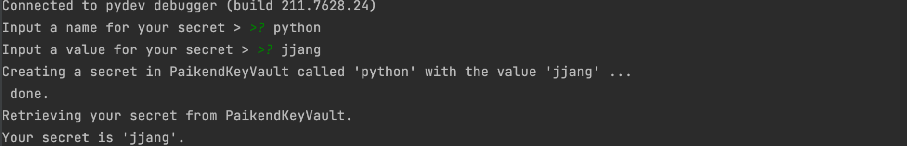
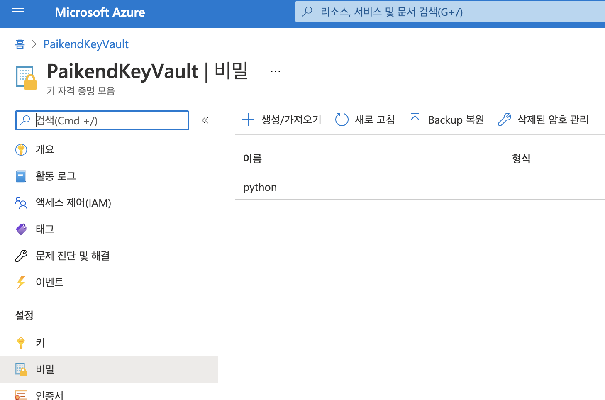
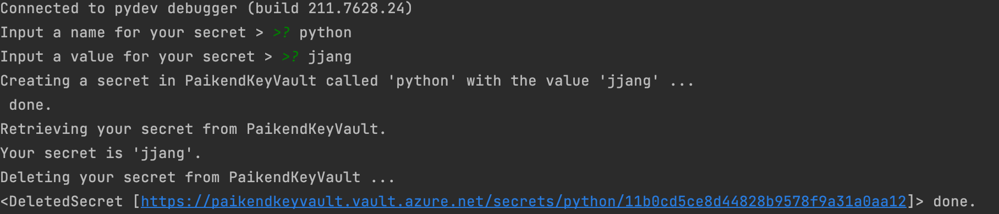
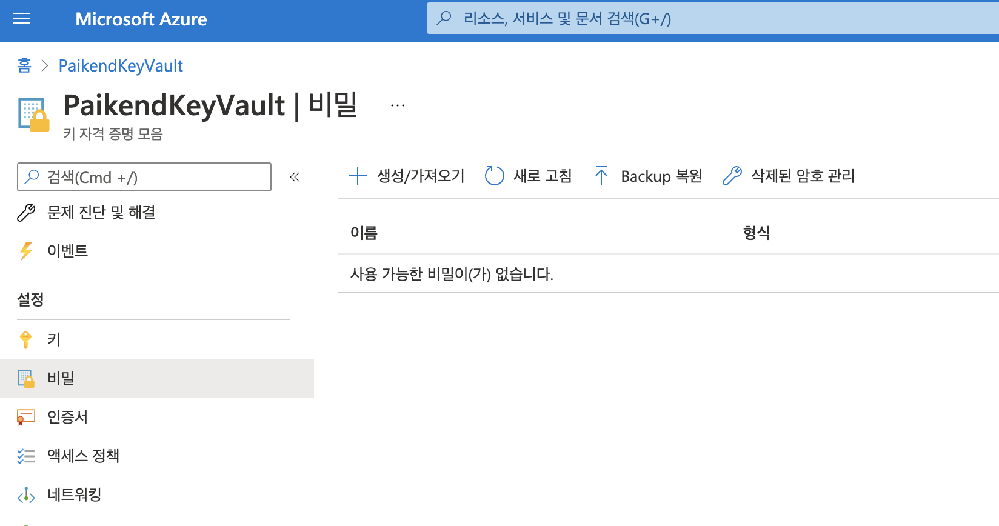

### azure keyvault demo

### 파이썬 버전
- Python 3.9.2

### 환경 세팅
```
./creatate_env.sh
```
* 참고: sh 파일 실행 후  KeyVault 권한을 추가해야 합니다. 
    - https://docs.microsoft.com/en-us/answers/questions/74848/access-denied-to-first-party-service.html
    - KeyVaultName은 Global Unique 자원입니다.
### 데모 스크립트 실행
```
python kv_secrets.py
```
1.인증 및 키 생성



2.키 생성 확인



3.생성된 키 제거



4. 키 제거 확인



